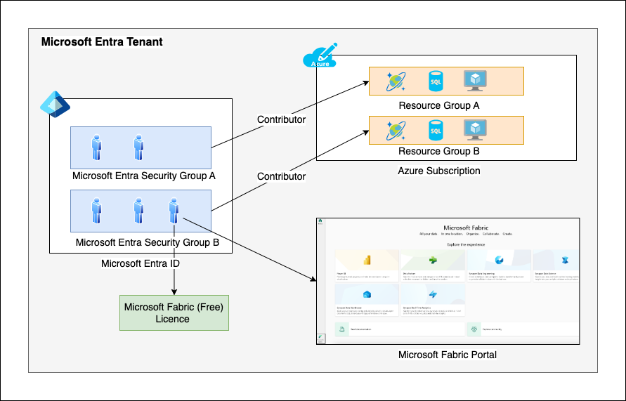

# Infrastructure Deployment Instructions

## Introduction

This document describes the process of deploying the Azure infrastructure for the Data Mesh hack. The infrastructure is deployed as a set of Azure resources that collectively represents the customer's existing data estate.

The details about the challenges can be found [here](https://internal.playbook.microsoft.com/code-with-dataops/hackhub/data-mesh-hack/).

## Deployment Overview

The Data Mesh hack can be attempted in two modes, as a team or as an individual. These modes are applicable when you are solving the challenges.

Irrespective of this choice, the deployment options are the same. If you are working on the hack as a team, you can deploy multiple instances of the infrastructure, one for the team. If you are working on the hack as an individual, you can deploy one instance of infrastructure, just for yourself. This setting is controlled by a parameter in the deployment script (described later).

### As a Team

This is the recommended way to attempt the hack. In this case, the team members are assigned to a team and multiple instances of the infrastructure is deployed, one for each team. The following diagram shows the overall architecture:



Here are the key points to note:

- The Fabric users are created in Azure AD. Multiple users can be created at the same time using the bulk-create APIs. Participant will use these user credentials to access both Microsoft Fabric and Azure Portal.
- Multiple users are assigned to the same team. The team is represented as an Azure AD security group with dynamic membership rules based on the user's email address naming convention.
- The infrastructure is spin per team in a separate resource group. i.e., each team would have a resource group where all the resources are deployed.
- The team's security group is granted "Contributor" permission at the resource group scope so that the members of the team can access the resources in the resource group.
- The Azure infrastructure is deployed in the same tenant as that of Microsoft Fabric. This is not mandatory, but it is recommended to simplify the deployment using AD security group which otherwise won't be possible.

Another reason for attempting these challenges as a hack is to promote discussion and brainstorming. Data Mesh is a relatively newer architecture pattern and discussing it as a team will help in understanding the concepts better.

### As an Individual

In this case, the challenges are attempted as an individual. The individual who is attempting the hack deploys his/her own infrastructure. The deployment script still relies on Azure AD security groups to grant access to the resources. You can just add yourself as a member of the security group and access the resources.

## Prerequisites

- [Python 3+](https://www.python.org/download/releases/3.0/)
- [Azure Bicep](https://learn.microsoft.com/azure/azure-resource-manager/bicep/overview?tabs=bicep)
- [AZ CLI 2.50+](https://learn.microsoft.com/cli/azure/install-azure-cli)
- [jq](https://stedolan.github.io/jq/)

## Setting up Permissions

Before continuing ensure you understand the permissions needed to run the challenges on your Azure subscription.

As part of the infra deployment, a new resource group is created, and all the Azure resources are deployed in that resource group. So, ideally you should have a subscription owner role on the subscription where you want to deploy the infrastructure.

You shall also have the permission to create Azure AD users and groups. Sometimes, users don't have access to create AD security groups. In such cases, you can skip the creation of the security group and manually grant yourself access to the resource group. For that, you would need to understand the working of the script and tweak it yourself. The script is well documented, and you can easily understand the steps. The script is located at `/scripts/deploy.sh`. 

## Common Azure Resources

The following is a list of common Azure resources that are deployed and utilized during the infrastructure deployment. 

Ensure that these services are not blocked by Azure Policy. As this is a self-serve hack, the services that attendees can utilize are not limited to this list so subscriptions with a tightly controlled service catalog may run into issues if the service an attendee wishes to use is disabled via policy.

| Azure resource           | Resource Providers        | Comments                                                |
| ------------------------ | ------------------------- | ------------------------------------------------------- |
| Azure Cosmos DB          | Microsoft.DocumentDB      | SouthRidge Video "movie" catalog                        |
| Azure SQL Database       | Microsoft.Sql             | SouthRidge Video "CloudSales" and "CloudStreaming" data |
| Azure Data Lake Store    | Microsoft.DataLakeStore   | FourthCoffee "Movies" and "Sales" data                  |
| Azure Key Vault          | Microsoft.KeyVault        | To store various secret keys                            |
| Microsoft Purview        | Microsoft.Purview         | Optional, to scan Microsoft Power BI for data discovery |

> Note:  Resource Provider Registration can be found at https://portal.azure.com/<yourtenantname>.onmicrosoft.com/resource/subscriptions/<yoursubscriptionid>/resourceproviders

## Deployment Instructions

### Understanding the Deployment Scripts

The main deployment script is `/scripts/deploy.sh`. This script is used to deploy the infrastructure for a team or an individual. The script takes the following parameters:

| Parameter | Description                                                                                                                                   | Required | Default         |
| --------- | --------------------------------------------------------------------------------------------------------------------------------------------- | -------- | --------------- |
| -n        | The number of teams participating. The script would deploy these many instances of Azure Infrastructure in a loop.                            | No       | 1               |
| -p        | The password for the SQL Server admin account.                                                                                                | No       | "mesh#ohPwd001" |
| -f        | Flag to indicate if Microsoft Purview should be included in the deployment. It is used during the challenges for scanning Microsoft Power BI. | No       | true            |

If you are attempting the challenges as an individual, you can set `-n` (team count) to 1 and the script will deploy only one instance of the infrastructure.

The script performs the following operations:

- Loops `-n` (team count) times and does the following for each team:
  - Creates a resource group for the Azure infrastructure deployment. The default name of the resource group is "rg-team-xx" (xx: 01, 02 etc.).
  - Deploy the Azure infrastructure in the resource group using Azure bicep. The main deployment file is `/scripts/infra/bicep/main.bicep`. The details for this script are explained in the next section.
  - Reads various azure resources details from the deployment output in local variables.
  - Uploads the "FourthCoffee" CSV files in `/scripts/data/fourthcoffee` folder to the Azure Data Lake storage account.
  - Uploads the following "SouthRidge Video" movie catalog JSON documents to the Azure CosmosDB account.
    - `/scripts/data/southridge/movie-southridge-v1.json`: Main movie data (1047 documents)
    - `/scripts/data/southridge/movie-southridge-v2.json`: New movie data (10 documents)
  - Import the "SouthRidge Video" CloudSales and CloudStreaming bacpac files to Azure SQL databases. This is run in background.
  - The script expects that AD security groups for each team have already been created and the members have been added to the group. The naming convention of the security group is "sg-team-xx" (xx: 01, 02 etc.)
    - If the security group is found, the scripts would fetch the Object ID of the group.
    - If the security group is not found, the script would create it and use the Object ID of this new group.
  - The security group would be granted `Storage Blob Data Contributor` role on the Azure Data Lake storage account.
  - The security group would be granted `Contributor` role on the resource group.
  - If Microsoft Purview has been deployed, the security group would be granted `Root Collection Admin` role on the Purview account.
  - If Microsoft Purview has been deployed, the script would also add the Purview identity to a security group named `sg-purview-fabric-scan`. This group is used during the challenge to scan Microsoft Power BI for data discovery.
    - If the security group `sg-purview-fabric-scan` is found, the scripts would fetch and use its Object ID.
    - If the security group `sg-purview-fabric-scan` is not found, the script would create it and use the Object ID of this new group. It would also add notes about the manual steps to be performed in the output.
  - The various secret keys are stored in the Azure Key Vault so that participants can use them during the challenges. The script would create a new Key Vault and store the following secrets in it:
    - `cosmosDbAccountKey`:  Azure CosmosDB account key
    - `storageAccountKey`: Azure Data Lake storage account key
    - `sqlAdminUsername`: Azure SQL Database admin username
    - `sqlAdminPassword`: Azure SQL Database admin password

## Deployment Instructions

1. You can use the following command to [clone](https://learn.microsoft.com/azure/devops/repos/git/clone?view=azure-devops&tabs=visual-studio-2022) the repo to the current directory:

   ```shell
   $ git clone https://github.com/cse-labs/opsplaybook.git
   ```

2. Change the current directory to the `data-mesh-hack\scripts` folder:

   ```shell
   $ cd data-mesh-hack\scripts
   ```

2. Open the [deploy.sh](./deploy.sh) script in an editor and review all the parameters and variables defined at the start of the script. You can change the default values if needed or choose to run the script with the default values.

3. Execute the following to sign into the Azure account and set the subscription which you want to deploy the resources to.

    ```shell
    $ az login
    $ az account set --subscription <mysubscription>
    ```

4. Run the following command to deploy the infrastructure for a single team:

   ```shell
   $ ./deploy.sh
   ```

   If you want to deploy the infrastructure for multiple teams, you can use the `-n` option:

   ```shell
    $ ./deploy.sh -n 2
    ```

    You can also additionally specify the `-p` and `-f` options as shown below:

    ```shell
    $ ./deploy.sh -n 2 -p "<password>" -f true
    ```

   > Note: If you are running the script for the first time, you may be prompted to install the Azure CLI extensions. Follow the instructions to install the extensions.

5. The script will take ~10 minutes per team to complete. So, if you are deploying it with n=3, it will take ~30 minutes to complete. Once the script completes, please carefully review the output messages, and follow the instructions as required.

### Validate the Deployment

1. Open the Azure portal and navigate to the resource group(s) created by the script. The name of the resource group would be "rg-team-xx" (xx: 01, 02 etc.).
2. Check the deployment status under "Settings" > "Deployments". The deployment should be successful.
3. Check the resources created in the resource group. The following resources should be created:
   - Azure Data Lake storage account
   - Azure CosmosDB account
   - Azure SQL Server
   - Azure SQL Database (CloudSales)
   - Azure SQL Database (CloudStreaming)
   - Azure Key Vault
   - Azure Purview account (if opted)
4. Check the Azure Data Lake storage account. It should have a container named "fourthcoffee" that contains the following files:
   - Actors.csv
   - Customers.csv
   - MovieActors.csv
   - Movies.csv
   - OnlineMovieMappings.csv
   - Transactions.csv
5. Check the Azure CosmosDB account. It should have a database named "southridge" that contains two containers:
   - `movies`: This container should have 1047 documents.
   - `new-movies`: This container should have 10 documents.
   - Both the containers should have a "synopsis" column.
6. Check the "Activity Log" for Azure SQL Database (CloudSales).
   - It should have a "Import database from bacpac" operation with status "Succeeded". This indicates that the bacpac file was imported successfully.
7. Check the Azure SQL Database (CloudStreaming). It should have the following tables:
   - It should have a "Import database from bacpac" operation with status "Succeeded". This indicates that the bacpac file was imported successfully.
8. Check the Azure Key Vault created by the script. It should have the following secrets:
   - `cosmosDbAccountKey`: Azure CosmosDB account key
   - `storageAccountKey`: Azure Data Lake storage account key
   - `sqlAdminUsername`: Azure SQL Database admin username
   - `sqlAdminPassword`: Azure SQL Database admin password 

A script would be added in future to make the validation process easier.

## General Observations

The deployment script has some behaviors that you should be aware of. Here are some of the observations:

### Region Settings

The [deploy.sh](./deploy.sh) script has a case statement where multiple regions are hardcoded. This is to avoid the per-subscription usage limit of Microsoft Purview. By default, you can only deploy 3 Microsoft Purview accounts per subscription. So, the script tries to deploy the infrastructure in different regions to avoid this limit. Please feel free to review and modify this region list based on your requirements. The default deployment region is "australiaeast".

You can also choose to not deploy Microsoft Purview by setting the `deployPurview` variable to `false` in the script.

### Azure AD Security Groups

The script expects that the Azure AD security groups for each team have already been created and the members have been added to the group. The naming convention of the security group is "sg-team-xx" (xx: 01, 02 etc.). These security groups have dynamic membership rules defined. The idea is that we create multiple users with specific naming convention `teamX.userY@<org-domain>`. Because of the dynamic membership rules, the users would be automatically added to the security group. The dynamic membership rule is defined as below:

```txt
(user.userPrincipalName -startsWith "teamX")
```

The script [/infra/generate-csv-for-creating-aad-users.py](./infra/generate-csv-for-creating-aad-users.py) can be used to generate the template for creating users in bulk based on the above naming convention. For more information about bulk-creating users in Azure AD, refer to [Bulk create users](https://learn.microsoft.com/azure/active-directory/enterprise-users/users-bulk-add).

With the latest changes, the script now creates the AD security group, if its not present. But this group will have static membership rules. You will have to add the members manually after the deployment completes.

### BACPAC file is not imported using bicep

The import of the bacpac files to Azure SQL databases is not done using bicep. This is because the import process takes a long time to complete, and the script might timeout or the whole deployment process would take a long time. So, the import is done in background using the Azure CLI command [az sql db import](https://learn.microsoft.com/cli/azure/sql/db?view=azure-cli-latest#az-sql-db-import).

If you are interested in learning about the import option in bicep, check out the commented section in [/infra/bicep/azure-sql.bicep](./infra/bicep/azure-sql.bicep) file.

### Adding Purview identity to Azure AD security group

The script adds the Purview identity to a security group named "sg-purview-fabric-scan". This group is used during the challenge to scan Microsoft Power BI for data discovery. If the security group "sg-purview-fabric-scan" is not found, the script would create one for you and add notes above the manual steps to be performed.

For more information on connecting to and manage a Power BI tenant in Microsoft Purview, check out the Microsoft [documentation](https://learn.microsoft.com/en-us/purview/register-scan-power-bi-tenant?tabs=Scenario1). For information about the scanning of Power BI using read-only admin APIs via Microsoft Purview, check out the Microsoft [documentation](https://learn.microsoft.com/fabric/admin/metadata-scanning-enable-read-only-apis).
