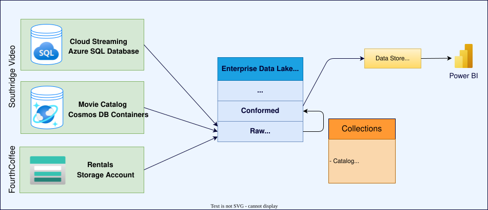

# Learn about Data Mesh

Data Mesh is a socio-technical architectural paradigm in which data is treated as a product and is owned by domain experts. These challenges help you understand the key concepts of Data Mesh and how to apply them to a real-world scenario.

It's highly recommended that you consider [Microsoft Fabric](/fabric/get-started/microsoft-fabric-overview) for your implementation's underlying platform. Microsoft Fabric is a comprehensive analytics solution for enterprises, encompassing data movement, data science, real-time analytics, and business intelligence.

With the ability to create shortcuts, define domains, and use workspaces as data product boundaries, Microsoft Fabric is a perfect fit for Data Mesh. Built on a SaaS foundation, Fabric allows customers to focus on solving business problems, freeing them from the need to integrate, manage, or understand the underlying infrastructure that supports the experience.

To get started consider the following example.

## Introducing Southridge Video

Southridge Video started off as a movie streaming and DVD company. To create a better touch experience, they acquired a brick and mortar media store called 'FourthCoffee'. To help with decision making, the company developed a modern data warehouse where they ingested data from different sources, developed a dimensional data model and published dashboards to share insights.

To develop the central data warehouse, Southridge Video combines data from a variety of sources such as Azure SQL Databases, Cosmos DB and Azure Storage Account. These sources contribute various datasets, encompassing DVD rentals, movie streaming, movie catalog, actors, and customer information.

All data from the source systems are ingested into the Enterprise Data Lake by the central data processing pipeline infrastructure. Data is first loaded into a `Raw` layer where it is grouped by source systems. This raw data goes through data standardization and data quality checks and moves to `Conformed` layer. Finally, the data is transformed into a star schema for businesses to consume. The entire data infrastructure is managed by a single data engineering team at Southridge.

The following architecture diagram shows the high-level components and data flow of the existing data warehouse:

## Understand the challenges and opportunities

The company has been thriving, experiencing significant growth in recent times with their streaming platform performing exceptionally well. To refocus efforts in movie streaming, they have expanded into movie production. However, fierce competition is putting pressure on both the movie production team and the sales team to act and adapt quickly. Their current centralized MDW system is struggling to meet the demands of their flourishing business. The centralized data engineering team faces challenges such as prolonged turnaround times to fulfill requests and difficulties in providing support and troubleshooting due to lack of domain expertise.

Recognizing the challenges of a centralized system in a fast-moving world, Southridge Video has made the decision to redesign their centralized architecture and adopt a more decentralized domain-driven design. This new approach involves splitting the monolithic data warehouse into multiple data domains, with each domain having its own dedicated team responsible for managing the data assets specific to that domain. Additionally, prescribed governance measures will be put in place to ensure consistency and coherence across domains.

## Know the desired outcomes

During this upskilling hack, the focus is on redesigning the data platform while addressing a crucial business request from Southridge Video. This request entails the implementation of an advanced movie search functionality. Southridge Video aims to offer its customers a personalized search experience by exclusively presenting relevant movies for each search query. The new data architecture will be used to support the development of this functionality.

## For more information

- [DataOps for the modern data warehouse](/azure/architecture/example-scenario/data-warehouse/dataops-mdw)
- [Microsoft Solutions Playbook: Modern Data Warehouse](../../solutions/modern-data-warehouse/index.md)
- [External Blog: Moving Beyond a Monolithic Data Lake](https://martinfowler.com/articles/data-monolith-to-mesh.html)
- [Microsoft Solutions Playbook: Data Mesh Architecture](../../solutions/data-mesh/index.md)
- [Microsoft Learning Path: Get started with Microsoft Fabric](/training/paths/get-started-fabric/)
