# Implement the data products

Once the data domains, data products, and their ownerships have been identified, the next step is implementation.

## Provide the Data Mesh context

 This involves the business handing over the requirements to the data engineers and architects.

The data engineers and architects are then tasked with comprehending the business requirements and the available data to design and construct the data products. This commences by connecting to various source systems and examining the various datasets available.

The data products are meant to be self-contained and autonomous. This means that the data products should be able to ingest, transform, and serve data without affecting other data products. This is a key aspect of the Data Mesh architecture. For a greenfield project, it's a good idea to start by focusing on a single data product and build it end-to-end. This will help in understanding the challenges and best practices. Once the first data product is built, the same approach can be applied to other data products.

Finally, the data products should be able to serve data to other data products and also consume data from other data products. This is achieved by defining the consumption interface for the data products. The consumption interface is the mechanism by which the data products can be consumed by other data products. The consumption interface can be in the form of a dataset, SQL Table, JSON file, REST API and so on.

## Review the background story

The Southridge leadership team is thrilled about the design of the new decentralized data architecture and its potential impact. Based on the available datasets and business requirements, the team has proposed the following data products:

|      Domain      |          Data Products          |
|:----------------|
| Movie Production | Movie Catalog (includes Actors) |
|      Sales       |      Customers   Sales       |

Though it's possible to come up with different data product breakdown, for this hackathon it will be this proposal.

There is an urgent request to determine the current movie portfolio to refine the strategy for future film production. To respond to this request, the Southridge Movie Production team must consolidate Movie Catalog data, which includes the movies from Southridge and FourthCoffee.

The leadership team wants to test the capabilities of the new architecture by providing an answer for this question in developing a data product. A traditional workflow includes loading the data from operational data sources, passing it through transformation layers, and applying data quality verification. A subset of the data from this process is published through a consumption interface for other domains to consume.

Imagine you are the Southridge Movie Production Team. In this challenge, you will set up the data products in the Movie Production domain and publish the data for external-to-the-domain consumption.

## Understanding technical details

To support data as a product that domains can autonomously serve or consume, Data Mesh introduces the concept of data product. Data product encapsulates three structural components required for its function, providing access to the domain's analytical data as a product. The three components are:

- Data and Metadata: The data and associated metadata to make it usable for consumers.
- Code: Code for data pipeline, code for serving data, and code for compliance.
- Infrastructure: Infrastructure for running data product's code, as well as storage.

In the previous challenge, the team has defined the domain breakdown and partially the data products. In this challenge, the data products for the Movie Production domain need to be expanded to cover all three components of a data product. It's important to keep in mind that a data product is an independent entity and any sharing of an artefact with another data product needs to be carefully planned.

The consumer of a data product doesn't need be aware of all the components of a data product. The data product owner should expose only a subset of the data as a [AAUnderstand the consumption interface](#understand-the-consumption-interface) for external-to-domain consumers.

Southridge and FourthCoffee both have their own catalog of movies and actors/actresses. A movie mapping table has been created for FourthCoffee to join movies that exist in both the Southridge and FourthCoffee movie catalog.

Here is a quick summary of the different data sources for Southridge and FourthCoffee:

### Understanding Southridge resources

Southridge Video uses an Azure SQL Database to store information about video streaming. The team will note that there is a `Hidden` schema in the databases. This data is for future use and is not meant to be looked into during this challenge. Credentials to access the Azure SQL Database are provided below. Alternatively, the team may set the Azure Active Directory Admin to one of the provided accounts, see [Configure and manage Azure AD authentication with Azure SQL](https://learn.microsoft.com/azure/azure-sql/database/authentication-aad-configure?view=azuresql&branch=main&tabs=azure-portal#provision-microsoft-entra-admin-sql-database).

The username for the Azure SQL databases is `southridge`. For password, refer to the login instructions provided separately.

Their movie catalog data with actors/actresses data is separately stored in an Azure Cosmos DB document collection. Access keys for Azure Cosmos DB are available from within the Azure portal, see [Secure access to data in Azure Cosmos DB](https://learn.microsoft.com/azure/cosmos-db/security).

### Understanding FourthCoffee resources

FourthCoffee uses a storage account to store its data.

Credentials to access the storage account are available from the Azure portal, see [Manage storage account access keys](/azure/storage/common/storage-account-keys-manage).

Please note that the dataset `OnlineMovieMappings.csv` is intended for joining FourthCoffee with Southridge movies using the `OnlineMovieID` column.

## Defining success criteria

1. You have completed the design of the data products in the Movie Production domain.
   - Connect to the different source systems and explore the source datasets using appropriate tooling.
   - Understand the relationship between the different datasets related to the *Movie Catalog* data product.
   - Define and create a logical container for each data product.
2. You have ingested 'movie' related data from source systems to the appropriate data product.
   - For Southridge, pull related data from the Cosmos DB collection.
   - For FourthCoffee, pull related data from the storage account.
   - While storing the data from different sources in the target storage, make sure data is grouped according to their source systems.
3. You have transformed and integrated data from source systems to build the consumption interface for the *Movie Catalog* data product.
   - Make sure the source system's datasets have been transformed to use consistent data types and formats. For example, if source systems use different data types or formats for a date, the final dataset stores all dates in a single, consistent, data type, and format.
   - Avoid record duplication and create only a single record per movie in the final dataset such as, the same movie can exist in more than one source system. In such cases, consolidate the movie information into a single record with the following priority order:
      1. Southridge
      2. FourthCoffee
   - For each movie record in the above step, create a unique identifier.
   - Add the source system movie identifiers as additional columns. This is necessary for using this data product as input to other data products, where these columns are essential for movie lookup.
   - Make sure the original extracted data is preserved, and ensure that the transformation jobs don't change it.
4. Though *Actors* data is part of the *Movie Catalog* data product, it's optional to include it in this challenge.

## Check your knowledge of definitions and explanations

The following knowledge checks are provided to enhance your experience with implementing data products.

### Understand the consumption interface

The term *consumption interface* refers to the mechanism of exposing a data product. In a Data Mesh architecture, one important aspect of data products is that they are easy to discover and consume. It means that they are cataloged and have a well-defined interface which exposes them to the consumers. This interface can be in the form of a dataset, SQL Table, JSON file, REST API and so on.

## Knowledge check

### Question 1

Why is autonomy an important characteristic of data products in Data Mesh?

a. To increase dependencies on other data products 
b. To simplify data operations 
c. To ensure they require constant maintenance 
d. To make them harder to access 

??? note "Answer! (Click to expand)"

The correct answer is option 'b'. Autonomy is an important characteristic of data products in Data Mesh because it simplifies data operations. It means that the data products should be able to ingest, transform, and serve data without affecting other data products.

### Question 2

What is the purpose of a consumption interface for data products in Data Mesh?

a. To prevent data sharing 
b. To limit access to data 
c. To define how data products interact with each other 
d. To categorize data by color 

??? note "Answer! (Click to expand)"

The correct answer is option 'c'. The consumption interface is the mechanism by which the data products can be consumed by other data products. The consumption interface can be in the form of a dataset, SQL Table, JSON file, REST API, and so on.

### Question 3

In a greenfield project, what is the recommended initial focus regarding data products?

a. Develop as many data products as possible simultaneously 
b. Ignore data products and focus on hardware 
c. Concentrate on building a single data product end-to-end 
d. Outsource data product development to other companies 

??? note "Answer! (Click to expand)"

The correct answer is option 'c'. In a greenfield project, focusing on a single data product and building it end-to-end helps in understanding the challenges and also the best practices. Once the first data product is built, the same approach can be applied to other data products.

## For more information

- [Microsoft Fabric: OneLake shortcuts](https://learn.microsoft.com/fabric/onelake/onelake-shortcuts)
- [Microsoft Fabric: ADF Copy activity](https://learn.microsoft.com/fabric/data-factory/copy-data-activity)
- [Microsoft Fabric: Moving and transforming data with dataflows and data pipelines](https://learn.microsoft.com/fabric/data-factory/transform-data)
- [Microsoft Fabric: Tutorial on prepare and transforming data in Lakehouse](https://learn.microsoft.com/fabric/data-engineering/tutorial-lakehouse-data-preparation)
- [Azure Databricks: Medallion Lakehouse Architecture](https://learn.microsoft.com/azure/databricks/lakehouse/medallion)
- [Microsoft Fabric Blog: Lakehouse Sharing and Access Permission Management](https://blog.fabric.microsoft.com/blog/lakehouse-sharing-and-access-permission-management)
- [Microsoft Solutions Playbook: Data Lake](https://learn.microsoft.com/data-engineering/playbook/solutions/modern-data-warehouse/#understanding-data-lake)
