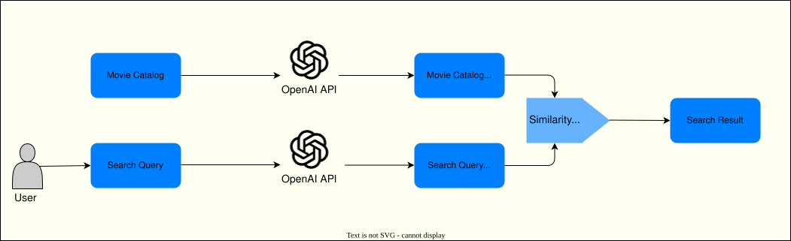

# Learn about search functionality

Accurate, robust search functionality is necessary to generating traffic for users to find what they are looking for.

## Using the Data Mesh context

Data Mesh is centered around instilling agility in both business and data teams. The goal is to empower business teams for quicker data-driven decision-making, while data teams should rapidly respond to business demands by furnishing the necessary data products.

This leads to creating many domains and data products. However, the utility of data products lies in their ability to deliver business value. If a data product doesn't contribute to the business, its existence is questionable.

This raises interesting questions. How do you gauge the contribution of a data product to the business? How can you measure its success? The answers to these questions are not straightforward. In a Data Mesh context, organizations should evaluate a data product's alignment with business objectives, track user adoption, and assess its affect on decision-making to determine its value.

One simple metric to gauge a data product's success by is to identify the number of other data products or applications consuming it. If multiple other data products or applications are using a data product, it's a strong indicator of its value to the business. These applications and services can vary, encompassing dashboards, reports, complex machine learning models, or microservices.

## Consider the background story

Southridge leadership is very impressed with the team's work! Finally, all the data products with the required data are ready for consumers. Excitement is growing; the data scientists are very excited to start working on it.

Southridge's streaming website presents a search interface on the homepage for the users to search for movies. The search functionality plays a significant role in generating traffic and driving movie views.

The existing search functionality on the website currently relies solely on [Consider a lexical search](#consider-a-lexical-search), which often fails to provide accurate results. To address this limitation, there is a desire to introduce a sophisticated [Consider a semantic search](#consider-a-semantic-search) capacity. This upgraded search mechanism will cater to complex scenarios, allowing users to search for terms such as "airplane films" and receive relevant suggestions like 'Top Gun.'.

Moreover, these search results take into account additional factors such as the user's location and previously viewed films, ensuring a more personalized and tailored experience.

Southridge leadership team is also very eager to see if the modern LLM technologies can be used to help with this use case, rather than trying to train their own model for this purpose.

Imagine you are the data science team, working on implementing the new version of the search functionality.

## Understand technical details

This challenge can be divided into two main areas, [Learn how to do a semantic search](#learn-how-to-do-a-semantic-search) and [Provide personalization](#provide-personalization).

### Learn how to do a semantic search

A semantic search can be implemented in multiple ways. It's highly recommended that you explore Azure OpenAI service to complete this challenge.

Movie title and other metadata as genre and synopsis can be used to implement the similarity search. OpenAi Similarity Embeddings models are very good at capturing semantic similarity between two or more pieces of text. It's possible to generate the embeddings of the movie title and other related data and compare that against the embedding of the search query.

### Provide personalization

Beyond a similarity search, the overall search experience can be improved by providing a personalized experience. From the rental and streaming data you can find out which movies the customer has previously watched. This information can be used to further refine search results.

you also have customer addresses. This information can be used to retrieve what movies are popular in a particular geography and based on that you can refine the search results.

## Define the success criteria

1. You have extended the architecture presented in the [Understand technical details](#understand-technical-details) section to include the following details:
   - Choose an OpenAI model for generating embeddings.
   - Identify the attributes/columns from the `Movie Catalog` data product to use for generating embeddings.
   - Describe the logic for applying personalization to the results of the similarity search.
   - Maintain a simple architecture without introducing unnecessary components. Consider using an in-memory approach for storing and searching embeddings.
2. You have implemented the similarity search.
3. You have implemented personalization on the search results by using at least one of the following strategies:
   - Customer's previously watched movies.
   - Customer's geography.

## Using and understanding definitions and explanations

### Consider a Lexical search

Lexical search refers to a type of search method that focuses on the literal or exact matching of words or phrases within a given text or database. It involves searching for specific terms or expressions without considering their context or meaning. In a lexical search, the emphasis is on finding exact matches rather than interpreting the underlying semantics or relationships between words. This type of search is commonly used in information retrieval systems, text analysis, and linguistic research.

### Consider a Semantic search

Semantic search is an advanced search technique that aims to understand the intent and meaning behind a user's query rather than relying solely on literal keyword matching. It goes beyond the surface level of words and takes into consideration the context, relationships, and concepts associated with the search query. By utilizing natural language processing (NLP) and machine learning algorithms, a semantic search attempts to comprehend the user's query and provide more relevant and accurate search results. It focuses on understanding the semantics, or meaning, of the search query and the content being searched, enabling it to deliver more contextually appropriate and insightful results. A semantic search enhances the search experience by considering concepts, synonyms, related terms, and contextual information to provide a deeper understanding of user intent and deliver more precise and valuable search results.

## Knowledge check

### Question 1

What role do embeddings play in generative AI models like GPT-3?

a. They determine the model's hardware configuration. 
b. They define the physical characteristics of AI-generated content. 
c. They represent contextual information and knowledge about words and concepts. 
d. They control the model's internet connection. 

??? note "Answer! (Click to expand)"

The correct answer is option 'c'. Embeddings are mathematical representations of data that capture meaningful relationships between entities. In generative AI models like GPT-3, embeddings represent contextual information and knowledge about words and concepts.

### Question 2

What is the primary purpose of personalization in online services and recommendations?

a. To provide a one-size-fits-all experience for all users. 
b. To tailor content and recommendations to individual user preferences. 
c. To maximize advertising revenue. 
d. To limit user choices and diversity in content. 

??? note "Answer! (Click to expand)"

The correct answer is option 'b'. Personalization is a key component of modern recommender systems, which are used to provide personalized recommendations to users based on their preferences and past behavior.

### Question 3

Which of the following models can be used to generate embeddings using Azure OpenAI Service?

a. text-embedding-ada-002 
b. gpt-4 
c. dalle2 
d. davinci-002 

??? note "Answer! (Click to expand)"

The correct answer is option 'a'. While the model names may change over time, generally, the 'text-embedding-ada-002' model can be used to generate embeddings using Azure OpenAI Service. 'GPT-4' is optimized for chat and works well for traditional completions tasks. 'Dalle2' is a text-to-image model that generates images from text prompts. 'Davinci-002' is a base model which is not trained to follow instructions. It should be queried as a point of reference to a fine-tuned version to evaluate training progress.

For more information

- [OpenAI: Embeddings](https://platform.openai.com/docs/guides/embeddings/what-are-embeddings)
- [OpenAI Repo: Python notebook for semantic text search using embeddings](https://github.com/openai/openai-cookbook/blob/main/examples/Semantic_text_search_using_embeddings.ipynb)
- [Microsoft Solutions Playbook: Azure OpenAI](https://review.learn.microsoft.com/ai/playbook/technology-guidance/generative-ai/getting-started/getting-started-with-openai)
- [Microsoft Solutions Playbook: Working with Large Language Models](https://review.learn.microsoft.com/ai/playbook/technology-guidance/generative-ai/working-with-llms/)
- [Azure AI Services: Tutorial on exploring embeddings and document search](/azure/ai-services/openai/tutorials/embeddings)
- [Cognitive Search: Add vector fields to a search index](https://learn.microsoft.com/azure/search/vector-search-how-to-create-index)
- [Cognitive Search: Create and use embeddings for search queries and documents](https://learn.microsoft.com/azure/search/vector-search-how-to-generate-embeddings)
- [Cognitive Search: Semantic search in Azure AI Search](https://learn.microsoft.com/azure/search/semantic-search-overview)
- [Cognitive Search: Vector search within Azure AI Search](https://learn.microsoft.com/azure/search/vector-search-overview)
