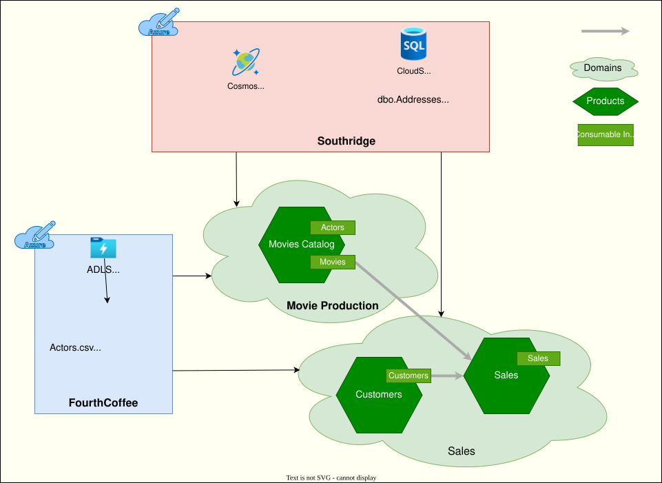

# Completion: Wrap Up

Congratulations on the completion of the Data Mesh Hack! Hopefully, you enjoyed the experience and learned a lot from it. In this section, the hack challenges will be summarized, and some pointers for the next steps will be provided.

## Summarization of challenges

The hack began with a real-world situation where the centralized data platform faced difficulties meeting the requirements of the growing business needs of Southridge Video. Consequently, the organization decided to investigate a decentralized, domain-centric data architecture known as Data Mesh.

In the first phase (challenge 1), the organization delved into its business operations, and mapped the business domains to data domains and data products.

Moving on to the second phase (challenge 2), the team concentrated on implementing the 'Movie Catalog' data product, making it their initial target. The goal was to learn from the challenges and mistakes encountered in this process and apply these lessons to future data products. The implementation of data product followed the traditional data engineering process, which involved data ingestion, data transformation, and data consumption.

Upon successfully implementing the 'Movie Catalog' data product, the team progressed to the third phase (challenge 3), where they implemented the remaining data products in a different domain. This phase also involved exploring how other data products could be utilized by one another.

The fourth phase (challenge 4) presented a significant challenge due to the complexity of Data Governance. Decentralized data governance added an extra layer of difficulty. The team explored various aspects of data governance including cataloging, lineage, and access control.

The fifth phase (challenge 5) proved to be the most intriguing. Creating data products is only valuable when they contribute to the business. In this phase, the team developed a semantic search application capable of providing meaningful recommendations to end users based on their search queries.

The sixth and final phase (challenge 6) revolved around the concept of data quality monitoring. It involved managing data validations and business validations for newly ingested data. Additionally, the team explored the option of having data quality dashboards for monitoring at the data product level.

## Understanding the target architecture

The envisioned Data Mesh architecture resembles the diagram provided below. It's important to note that this diagram is only meant to provide a high-level overview of the architecture. Your implementation may differ from this diagram, which is perfectly acceptable.



## Cleaning up resources

Before you wrap up, make sure to clean up the resources created for this hack. You can do so by following the steps below:

- Delete the resource group that you created for this hack as part of Infrastructure as Code (IaC) setup for the existing data estate. You can do so from the Azure Portal or by running the following az command:

```sh
az group delete --name <resource-group-name> --yes --no-wait
```

- Consider deleting the Microsoft Fabric Workspace(s) created for this hack, if you don't need it anymore.

- Also consider cleaning up the following items, if you created these as part of the hack. Please note that these actions require elevated permissions.
  - Microsoft Entra Security Groups
  - Microsoft Fabric Domains

## Providing feedback

Your feedback is crucial for ongoing improvement of content, tools, and the overall experience for future participants. Please use the following links to provide feedback:

- [Hack Content Feedback](https://aka.ms/ISEUpskillingFeedback)
- [Product Feedback](https://aka.ms/ISEUpskillingProductFeedback)
  - Open a new Product Feedback work item as a child link
- Improve the hack content directly in the Microsoft Solutions Playbook by opening a PR. Refer to the [Contributing Guide](https://review.learn.microsoft.com/industry/playbook/cross-industry/contributing/) for more details.

## Taking the next steps

Now that you have completed the Data Mesh Hack, here are some recommendations for the next steps in your learning journey:

- Explore the [Artificial Intelligence: Large Language Model Lab](https://review.learn.microsoft.com/ai/playbook/technology-guidance/generative-ai/lab/llm-lab/) which has a similar format to the Data Mesh Hack.
- Familiarize yourself with Microsoft Fabric by reading the [public documentation](https://learn.microsoft.com/fabric/).
- Gain hands-on expertise in Microsoft Fabric by following the [Get started with Microsoft Fabric](https://learn.microsoft.com/training/paths/get-started-fabric) learning path.
